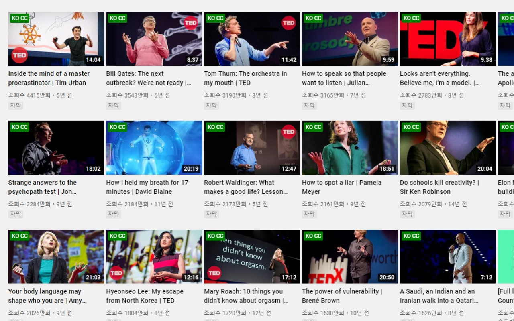
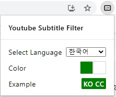

# YouTube Subtitle Filter

Add a subtitle tag to the video in the language you want.

## Showcase

## Customize
- You can customize tag color in popup menu (background and text color)

## Download
[Chrome Web Store](https://chrome.google.com/webstore/detail/Youtube-subtitle-filter/onmelgncdnoihoaopmkcacadlmjmcehd)