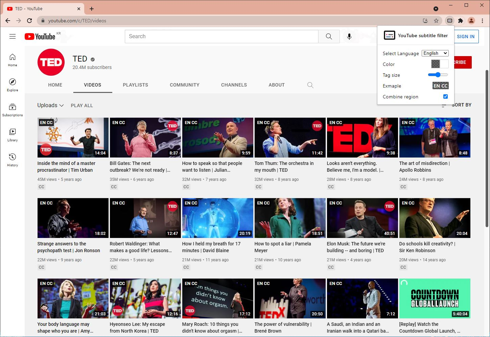
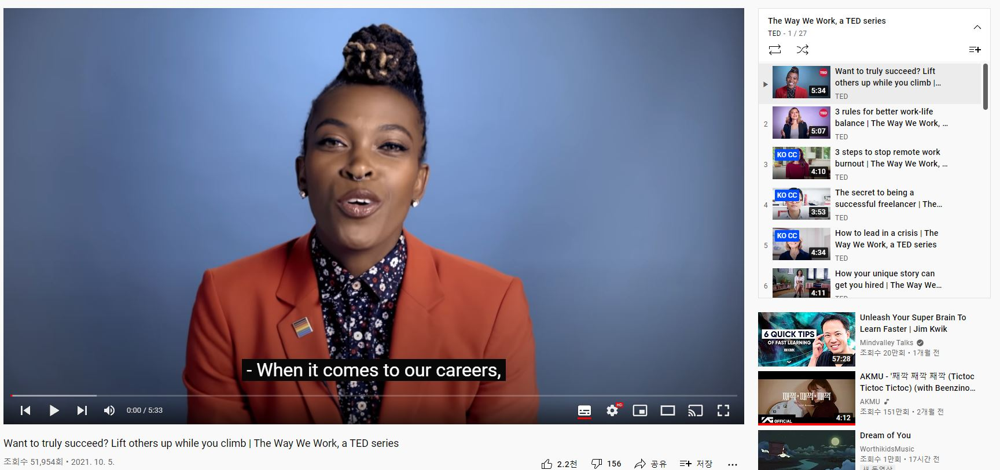
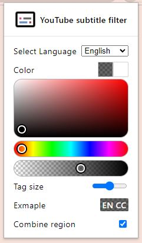

  

<h1 align="center">YouTube Caption Checker</h1>

We support Korean version!
follow the below page to read it in multiple languages.

[한국어](README_KO.md)

Show if there are captions for the language you want in YouTube videos.

## Download

- [Chrome Web Store](https://chrome.google.com/webstore/detail/Youtube-subtitle-filter/onmelgncdnoihoaopmkcacadlmjmcehd)

- [Firefox Add On](https://addons.mozilla.org/ko/firefox/addon/youtube-subtitle-filter)

---

## Showcase

---

## Customize

- You can customize tag color in popup menu (background and text color)

- You can resize the caption tags

- You can search for captions by grouping regions. (ex en-US + en-GB)

---

## How to build

### Prerequisite

- Node.js
- npm

### Step by step

1. run `npm install` in terminal.
2. run `npm run build:[chrome or firefox]` in terminal. (built source will be created in `dist` folder)
3. run `npm run build:zip:[chrome or firefox]` in terminal.
4. then, `[chrome or firefox] yt-caption-checker-[version].zip` will be created.
