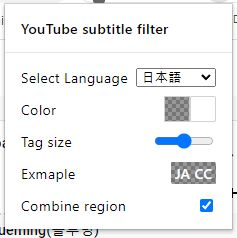
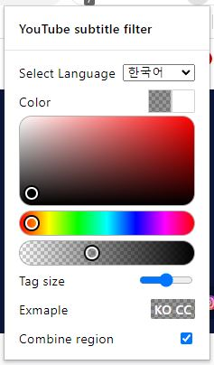

# YouTube Subtitle Filter

We support Korean version!
follow the below page to read it in multiple languages.

[한국어 보기](README_KO.md)

Add a subtitle tag language that you want on the video thumbnail in the YouTube.

## Showcase

## Customize
- You can customize tag color in popup menu (background and text color)
- You can resize the subtitle tags
- You can search for subtitles by grouping regions. (ex en-US + en-GB)

 

## Download
[Chrome Web Store](https://chrome.google.com/webstore/detail/Youtube-subtitle-filter/onmelgncdnoihoaopmkcacadlmjmcehd)
[Firefox Add On](https://addons.mozilla.org/ko/firefox/addon/youtube-subtitle-filter)