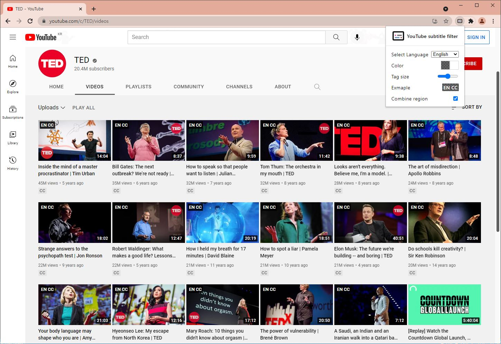

  

<h1 align="center">YouTube Subtitle Filter</h1>

We support Korean version!
follow the below page to read it in multiple languages.

[한국어](README_KO.md)

Add a subtitle tag language that you want on the video thumbnail in the YouTube.

## Download

- [Chrome Web Store](https://chrome.google.com/webstore/detail/Youtube-subtitle-filter/onmelgncdnoihoaopmkcacadlmjmcehd)

- [Firefox Add On](https://addons.mozilla.org/ko/firefox/addon/youtube-subtitle-filter)

---

## Showcase

---

## Customize

- You can customize tag color in popup menu (background and text color)

- You can resize the subtitle tags

- You can search for subtitles by grouping regions. (ex en-US + en-GB)
