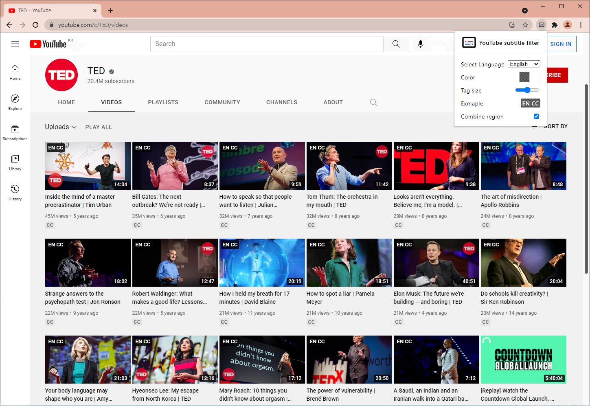

  

<h1 align="center">유튜브 자막 필터</h1>

README 페이지를 영문로 보시려면 아래를 참고하세요.

[영문](README.md)

유튜브 내 동영상 썸네일에 원하는 언어의 자막 태그를 추가해줍니다.

## 다운로드

- [Chrome 웹 스토어](https://chrome.google.com/webstore/detail/Youtube-subtitle-filter/onmelgncdnoihoaopmkcacadlmjmcehd)

- [Firefox Add On](https://addons.mozilla.org/ko/firefox/addon/youtube-subtitle-filter)

---

## 예시화면

---

## 사용자 설정

- 팝업 메뉴에서 태그의 색상을 선택할 수 있습니다. (배경색상, 글자색상)

- 태그의 크기를 조절 할 수 있습니다.

- 지역언어 통합 기능으로 여러지역으로 나눠진 자막을 하나로 검색할 수 도 있습니다. (예: 영어(영국) + 영어(미국))
